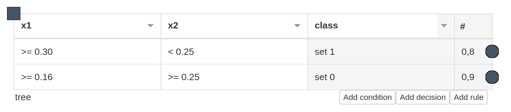

# uID3 w Pythonie
> Uncertain Decision Tree Classifier


Celem prac jest implementacja mechanizmu budowania drzew decyzyjnych z danych niepewnych.
  * Prace bazowac beda na artykule: [Uncertain Decision Tree Classifier for Mobile Context-Aware Computing](https://link.springer.com/chapter/10.1007/978-3-319-91262-2_25)
  * Prace bazowac beda na kodzie: [UID3](https://github.com/sbobek/udt)
  * Prace powinny implementowac klasyfikator zgodnie z konwencja [sklearn](https://scikit-learn.org/stable/modules/generated/sklearn.base.BaseEstimator.html)
  * Prace maja finalnie potwierdzic rownowaznosc implementacji Java i Python (z wylaczeniem sytuacji gdzie wersja Python poprawialaby bledne dzialanie wersji Java)
  * Do implementacji polecam wykorzystac framework [nbdev](https://nbdev.fast.ai/)
  * Implementacja powinna umozliwiac rysowanie drzew z wykorzystaniem graphviz:
  
  * Implementacja powinna umozliwiac eksport drzew do formatu HMR+, ktory zaczytywany jest przez webowy edytor [HWED](https://heartdroid.re/hwed/)
  
  - Kod powinien byc napisany i udokumentowany zgodnie z [PEP8](https://www.python.org/dev/peps/pep-0008/)
  


## Install

`pip install uid3`

## How to use

TODO -> code examples

```python
1+1
```


    2


